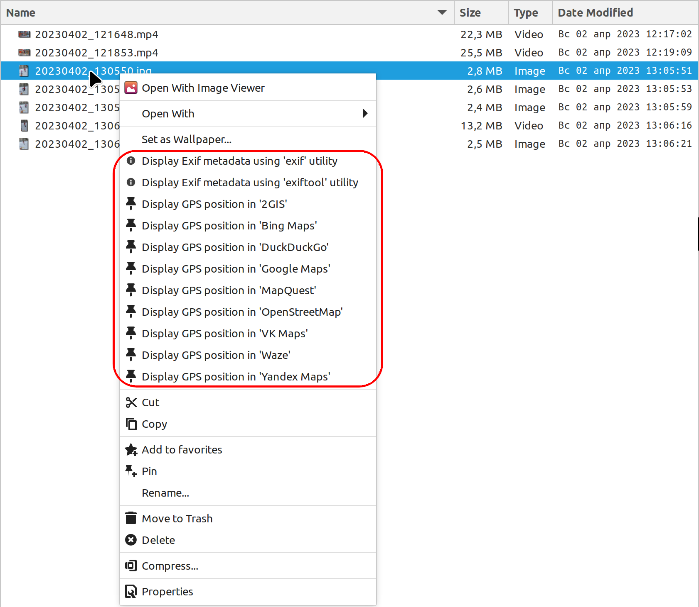

// This document is authored using Asciidoctor:
// https://asciidoctor.org/

# exif-gps-mapping-nemo

[.lead]
A collection of Cinnamon Nemo custom actions and related scripts for displaying Exif metadata of media files in Nemo and
for plotting GPS position thereof using various online mapping services

## Background

### Exif, Cinnamon Nemo

https://www.cipa.jp/std/documents/download_e.html?DC-008-Translation-2023-E[Exif] is a standard, specified{nbsp}/ issued
by JEIDA{nbsp}/ https://www.jeita.or.jp/english/[JEITA]{nbsp}/ https://www.cipa.jp/e/index.html[CIPA], that defines
formats for media files, as well as ancillary metadata tags, to be used by digital cameras{nbsp}/ scanners and sound
recorders. MPEG video formats also allow containing metadata in media files. This metadata, besides various technical
image information, such as camera make and model, aperture, shutter speed, focal length, ISO speed, etc., may also
contain geolocation information.

https://github.com/linuxmint/nemo[Nemo] is the file manager for the https://github.com/linuxmint/cinnamon[Cinnamon]
desktop environment, the primary one for https://linuxmint.com/[Linux Mint].

### The problem

Nemo out-of-the box facilities for displaying media file metadata are limited and allow no access to geolocation info.

Command-line utilities exist like https://github.com/libexif/exif[`exif`] and https://exiftool.org/[`exiftool`], that
allow displaying various media file metadata in a terminal session, GPS position included, but no integration with Nemo
is immediately available, and no integration with online mapping services is available either.

## The solution

Nemo has a provision for being extended with custom actions and is distributed with a custom action example as
https://github.com/linuxmint/nemo/blob/master/files/usr/share/nemo/actions/sample.nemo_action[`sample.nemo_action`].

With mentioned `sample.nemo_action` as a prototype, custom Nemo actions and related scripts were developed that allow
performing various actions for files with `image/jpeg` and `video/mp4` media types:

- display Nemo{nbsp}/ https://gitlab.gnome.org/GNOME/zenity[Zenity] dialog box with Exif metadata being displayed in its
native tabular format available from `exif` or `exiftool` utility;
- display shooting point location using various online mapping services like OpenStreetMap, Google Maps, Bing Maps, etc.
in a browser of choice.

### The solution structure

A release archive contains the following files:

```
├─ nemo/
│  └─ actions/
│     ├─ action_scripts/
│     │  ├─ exif_metadata__functions.bash                : local reusable scripting functions
│     │  │                                               :   library
│     │  ├─ exif_metadata__mapping.bash                  : generic script to implement
│     │  │                                               :   interactions with online mapping
│     │  │                                               :   services
│     │  ├─ exif_metadata__settings.bash                 : the settings file
│     │  ├─ exif_metadata_list_exif.bash                 : script to display Exif metadata
│     │  │                                               :   using 'exif' utility
│     │  ├─ exif_metadata_list_exiftool.bash             : script to display Exif metadata
│     │  │                                               :   using 'exiftool' utility
│     │  └─ exif_metadata_mapping_*.bash                 : scripts for displaying GPS position in
│     │                                                  :   various online mapping services
│     │
│     │                                                  : Nemo action descriptors ...
│     ├─ exif_metadata_list_exif.nemo_action             : ... for displaying Exif metadata
│     │                                                  :   using 'exif' utility
│     ├─ exif_metadata_list_exiftool.nemo_action         : ... for displaying Exif metadata
│     │                                                  :   using 'exiftool' utility
│     └─ exif_metadata_mapping_*.nemo_action             : ... for displaying GPS position using
│                                                        :   various online mapping services
│
├─ readme/
│  └─ *.png                                              : figures for the user manual
│
├─ install-for-current-user.bash                         : script to install action descriptors
│                                                        :   and scripts to current user profile
├─ diff-with-current-user.bash                           : script to compare contents of the
│                                                        :   'nemo/actions' folder with those in
│                                                        :   current user profile
├─ COPYING                                               : GPL license text
├─ NOTICE                                                : GPL notice text
└─ README.adoc                                           : user manual (this document)
```

The approach with scripts separation from related actions into a nested folder was borrowed from
https://github.com/smurphos/nemo_actions_and_cinnamon_scripts[GitHub : smurphos : Nemo Actions & Cinnamon Scripts].

### Usage

- download a release archive and unpack to an arbitrary temporary folder;
- open the folder that was created upon unpacking the release archive;
- run the installation script as `./install-for-current-user.bash`.

With all that successfully in place, new context menu items should become available in Nemo for files that have
`image/jpeg` or `video/mp4` media types. These menu items include the following ones:

- Display Exif metadata using 'exif' utility;
- Display Exif metadata using 'exiftool' utility;
- Display GPS position in various online mapping services.

#### Screenshots

.New context menu items


.Popup window with 'exif' utility output


### Prerequisites

The solution requires at least one of the following utilities to be available:

// a table with:
// - automatic column width,
// - 2 columns top-aligned
[%autowidth,cols=2*.<]
|===
|'exif'
|a simple Exif data handling utility, limited to `image/jpeg` files only, typically bundled with Linux Mint

|'exiftool'
|a well-recognized Exif data handling utility, that supports an extended metadata tag set and a variety of media file
formats
|===

### Possible customizations

#### Internationalization

The solution currently has the following provisions for internationalization:

* `LANGUAGE` variable defined in `exif_metadata__settings.bash`:
** overrides{nbsp}/ shadows similar user profile variable;
** defaults to shortened language-code-only user profile setting as `"${LANGUAGE/_*/}"`;
** has effect on language settings of the utilities and of online mapping services;
* context menu item names and comment lines for metadata display actions, specified in related action descriptors.

#### Browser for displaying GPS position in online mapping services

Browser can be selected using the `BROWSER` variable defined in `exif_metadata__settings.bash` that defaults to default
system browser wrapper as `xdg-open`.

#### Types of media files handled by the solution

Types of media files handled by the solution are specified using their media types, and their list is currently
restricted to `image/jpeg` and `video/mp4` by the `Mimetypes` setting in related action descriptors.

Nothing prevents this list from being extended, provided that related media types are supported by metadata handling
utilities.

#### Online mapping services for displaying GPS position

Collection of online mapping services for displaying GPS position may be customized by deleting or adding to the
collection of `exif_metadata_mapping_*.nemo_action` descriptors and related scripts.

Please feel free to add more using existing ones as samples and contribute :)

#### Alternative{nbsp}/ extra metadata handling utilities

Collection of metadata handling utilities may be extended if necessary. Please feel free to consider
`exif_metadata_list_exif.bash` and `exif_metadata_list_exiftool.bash` scripts as samples for new utility wrappers.

## License

The project, being a derivative work based upon Nemo, inherits its GNU General Public License version 2, with related
information supplied in `COPYING` and `NOTICE` files.
